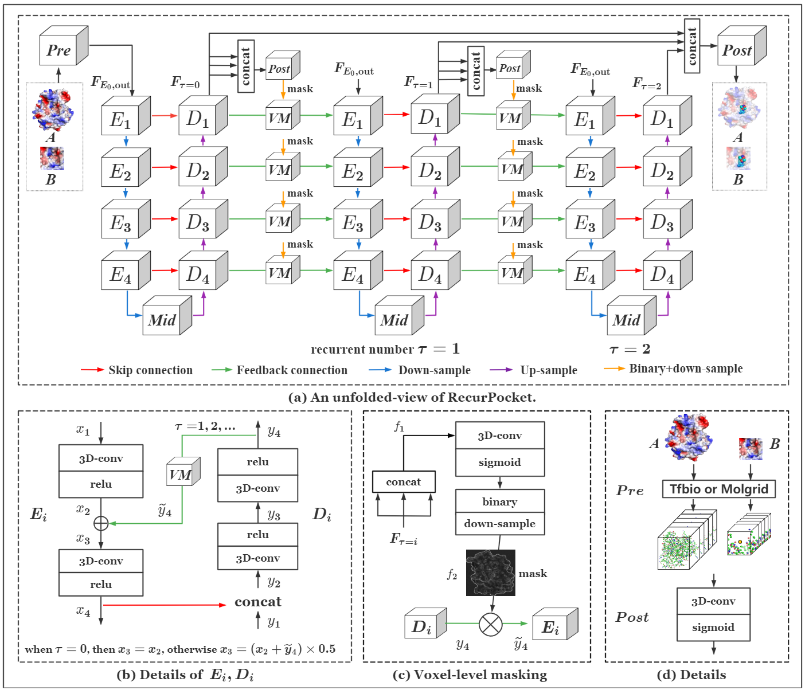
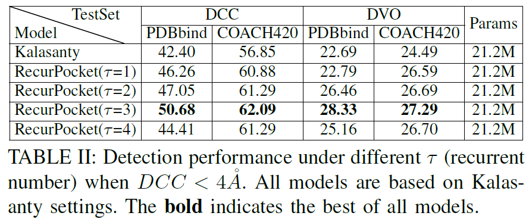
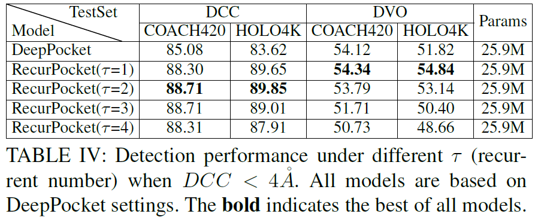
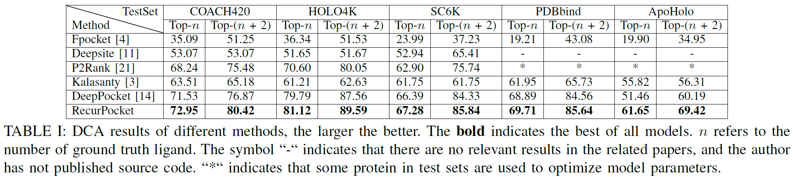

# RecurPocket: Recurrent Lmser Network with Gating Mechanism for Protein Binding Site Detection

This repository contains the source code, trained models and the test sets for our work:

RecurPocket: Recurrent Lmser Network with Gating Mechanism for Protein Binding Site Detection, Li P, Cao B, Tu S, Xu L. BIBM, 2022.

## Introduction

It is an essential step to locate the binding sites or pockets of drug molecules on protein structure in drug design. This is challenging because the 3D protein structures are usually in complicated, irregular shape and the pockets are relatively small. Existing deep learning methods for this task are U-Net models, and they have forward skip connections to efficiently transfer features of different levels of 3D structure from encoder to decoder for improving pocket prediction.    However, there is still room to improve prediction accuracy.    In this paper, we propose RecurPocket, a recurrent Lmser (Least mean square error reconstruction) network for pocket detection. A gated recurrent refinement is devised in RecurPocket to enhance the representation learning on the 3D protein structures. This is fulfilled by feedback connections in RecurPocket network from decoder to encoder, recurrently and progressively improving the feature embedding for accurate prediction. Moreover, a 3D gate mechanism filters out irrelevant information through the feedback links that interfere with detection, making the prediction more precise and clear. Experiments show that RecurPocket improves by $3\%-9\%$ on top-$n$ prediction compared with previous state-of-the-art on five benchmark data sets.



**Fig**：(a) An unfolded-view of our RecurPocket ($\tau$=2). *Pre* block is to convert 3D protein structure to multi-channel 3D grids. *Mid* block consists of 3D-conv and relu that repeat twice and is calculated forward. The input of VM in the same column is the same, which is the output of *Post* block. For simplicity and clarity, we omit the connections. (b) Details of encoder block ($E_i$) and decoder block ($D_i$). (c) Details of voxel-level masking. (d) Details of *Pre* and *Post* blocks.

## Dataset

**Train data:** You can download train data ``scPDB`` from here (http://bioinfo-pharma.u-strasbg.fr/scPDB/).

**Test data:** You can download test data sets  according to the links, `COACH420` (https://github.com/rdk/p2rank-datasets/tree/master/coach420), `PDBbind` (http://www.pdbbind.org.cn/download.php), `Chen (ApoHolo)` (http://biomine.cs.vcu.edu/datasets/BindingSitesPredictors/main.html), `HOLO4k` (https://github.com/rdk/p2rank-datasets/tree/master/holo4k), `SC6K` (https://github.com/devalab/DeepPocket).

You can also download our pre-processed train and test data from Baidu Cloud Disk `RecurPocket_release/dataset_RecurPocket` from Baidu Cloud Disk (https://pan.baidu.com/s/1xgQYgtFsQXI2EofCxh60Bw code：4ua7)

## Kalasanty settings

1. **Pre-trained models**

   Download `RecurPocket_release/ckpt_kalasanty` from Baidu Cloud Disk (https://pan.baidu.com/s/1xgQYgtFsQXI2EofCxh60Bw code：4ua7)
2. **Test models**
   If you want to test Kalasanty on these dataset: coach420, scpdb, pdbbind, apo_holo, coach420,  the commands are as follows.
   To test Kalasanty on coach420 for DCC and DVO test, run

   ```
   cd Kalasanty
   python -u test_camera.py --gpu 0 --test_set coach420 --model_path ckpt_kalasanty/baseline_model/1050_best_model.pth --DATA_ROOT /cmach-data/lipeiying/program/_Drug_/dataset --is_dca 0 -n 0
   ```

   Please note that:
   --gpu: gpu id
   --DATA_ROOT: the path to dataset root
   --model_path: the path of test model
   --is_dca=0: calculate DCC and DVO
   --is_dca=1, -n=0: calculate DCA top-n
   --is_dca=1, -n=2: calculate DCA top-n+2

   To test Kalasanty on coach420 for DCA test, run

   ```
   cd Kalasanty
   python -u test_camera.py --gpu 0 --test_set coach420 --model_path ckpt_kalasanty/baseline_model/1050_best_model.pth --DATA_ROOT /cmach-data/lipeiying/program/_Drug_/dataset --is_dca 1 -n 0
   ```

   If you want to test RecurPocket ($\tau=1,2,3,4$) based on kalasanty settings, please run the following commands.
   To test RecurPocket($\tau=1$)  without mask (*is_mask=0*) on coach420 for DCC and DVO test, run

   ```
   cd Kalasanty/recurrent
   python -u test_camera.py --gpu 0 --test_set coach420 --model_path ckpt_kalasanty/kalasanty-ite2/i2-recurrent-1300.pth --DATA_ROOT /cmach-data/lipeiying/program/_Drug_/dataset --is_dca 0 -n 0 --is_mask 0 --ite 2
   ```

   Please note that:
   --gpu: gpu id
   --DATA_ROOT: the path to dataset root
   --model_path: the path of test model
   --is_dca=1, -n=0: calculate DCA top-n
   --is_dca=1, -n=2: calculate DCA top-n+2
   --is_dca=0: calculate DCC and DVO.
   --is_mask=0: without mask
   --ite: iteration

   Attention: $\tau$ is `iteration-1`

   To test RecurPocket($\tau=1$) on coach420 for DCA test, run

   ```
   cd Kalasanty/recurrent
   python -u test_camera.py --gpu 0 --test_set coach420 --model_path ckpt_kalasanty/kalasanty-ite2/i2-recurrent-1300.pth --DATA_ROOT /cmach-data/lipeiying/program/_Drug_/dataset --is_dca 1 -n 0 --is_mask 0 --ite 2
   ```

   To test RecurPocket($\tau=2$) without mask on coach420 for DCC and DVO test, run

   ```
   cd Kalasanty/recurrent
   python -u test_camera.py --gpu 0 --test_set coach420 --model_path ckpt_kalasanty/kalasanty-ite3/best_model.pth --DATA_ROOT /cmach-data/lipeiying/program/_Drug_/dataset --is_dca 0 -n 0 --is_mask 0 --ite 3
   ```

   To test RecurPocket($\tau=2$) with mask on coach420 for DCC and DVO test, run

   ```
   cd Kalasanty/recurrent
   python -u test_camera.py --gpu 0 --test_set coach420 --model_path ckpt_kalasanty/kalasanty-ite3+mask/960.pth --DATA_ROOT /cmach-data/lipeiying/program/_Drug_/dataset --is_dca 0 -n 0 --is_mask 1 --ite 3
   ```


   
 
   
3. **Train Models**
   If you want to train Kalasanty by yourself, the command is as follows:

   ```
   cd Kalasanty
   python -u main.py --DATA_ROOT dataset_RecurPocket/ --save_dir checkpoint --gpu 0,1 --batch_size 200
   ```

   Please note that:
   --DATA_ROOT: the path to dataset root
   --save_dir: the path to save the model
   --gpu: gpu id
   --ite: iteration
   --batch_size: batch size

   If you want to train RecurPocket($\tau=1,2,3,4$) based on Kalasanty settings by yourself, such as RecurPocket($\tau=2$) without mask (is_mask=0), the command is as follows:

   ```
   cd Kalasanty/recurrent
   python -u main.py --DATA_ROOT dataset_RecurPocket/ --save_dir checkpoint --gpu 0,1 --is_mask 0 --iterations 3
   ```

   Please note that:
   --DATA_ROOT: the path to dataset root
   --save_dir: the path to save the model
   --gpu: gpu id
   --is_mask=0: without mask
   --ite: iteration

   Attention: $\tau$ is `iteration-1`

## DeepPocket settings

1. **Pre-trained models**

   Download `RecurPocket_release/ckpt_kalasanty` from Baidu Cloud Disk (https://pan.baidu.com/s/1xgQYgtFsQXI2EofCxh60Bw code：4ua7)
2. **Test Model**

   If you want to test DeepPocket on coach420 under DCC and DVO metrics, run

   ```
   cd DeepPocket
   python -u test_camera.py --gpu 0 --test_set coach420 --model_path ckpt_deeppocket/coach420_best_test_IOU_44.pth.tar --DATA_ROOT dataset_RecurPocket --is_dca 0 -n 0 --ite 1
   ```

   Please note that:
   --DATA_ROOT: the path to dataset root
   --gpu: gpu id
   --ite: iteration=1 for Kalasanty

   If you want to test DeepPocket on coach420 under DCA Top-n+2 metrics, run

   ```
   cd DeepPocket
   python -u test_camera.py --gpu 0 --test_set coach420 --model_path ckpt_deeppocket/coach420_best_test_IOU_44.pth.tar --DATA_ROOT dataset_RecurPocket --is_dca 1 -n 2 --ite 1
   ```

   If you want to test DeepPocket on apoholo under DCA Top-n+2 metrics, run

   ```
   cd DeepPocket
   python -u test_camera.py --gpu 0 --test_set apoholo --model_path ckpt_deeppocket/seg0_best_test_IOU_91.pth.tar --DATA_ROOT dataset_RecurPocket --is_dca 1 -n 2 --ite 1
   ```

   If you want to test RecurPocket($\tau=1$) based on DeepPocket settings on coach420 under DCC and DVO metrics, run

   ```
   cd DeepPocket
   python -u test_camera.py --gpu 0 --test_set coach420 --model_path ckpt_deeppocket/RecurPocket1_ite2/seg0_best_test_IOU_55.pth-1.tar --DATA_ROOT dataset_RecurPocket --is_dca 0 -n 0 --ite 2
   ```

   If you want to test RecurPocket($\tau=2$) with mask based on DeepPocket settings on coach420 under DCA metrics, run

   ```
   cd DeepPocket
   python -u test_camera.py --gpu 0 --test_set coach420 --model_path ckpt_deeppocket/RecurPocket2_ite3+mask/seg0-0.89919-42.pth.tar --DATA_ROOT dataset_RecurPocket --is_dca 1 -n 0 --ite 3 --is_mask 1
   ```

   

   Please note that, the results of Fpocket, Deepsite, and P2Rank under COACH420, HOLO4k, and SC6K are from DeepPocket paper. We download `coach420_best_test_IOU_44.pth.tar` checkpoint to test DeepPocket on COACH420, HOLO4K, SC6K PDBbind.  We download  `seg0_best_test_IOU_91.pth.tar` checkpoint to test DeepPocket on ApoHolo.  The results of `coach420_best_test_IOU_44.pth.tar` checkpoint on ApoHolo are 55.83 and 64.56 for Top-n and Top-(n+2). The Rank result of DeepPocket and RecurPocket on apoholo are re-rankd according to the volume of predicted pocket.

   
3. **Train Model**

   If you want to train DeepPocket or download pre-trianed DeepPocket models, you can refer to GitHub from authors (https://github.com/devalab/DeepPocket).

   If you want to train RecurPocket($\tau=1,2,3,4$) w/wo mask, for example, RecurPocket($\tau=1$) without mask, run

   ```
   cd DeepPocket
   python train_segmentation_v3.py --ite 2 --gpu 0,1 -b 10 -o ckpt/seg0 --DATA_ROOT dataset_RecurPocket
   ```

## Code Reference:

> http://gitlab.com/cheminfIBB/kalasanty
> https://github.com/devalab/DeepPocket
